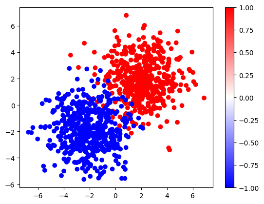
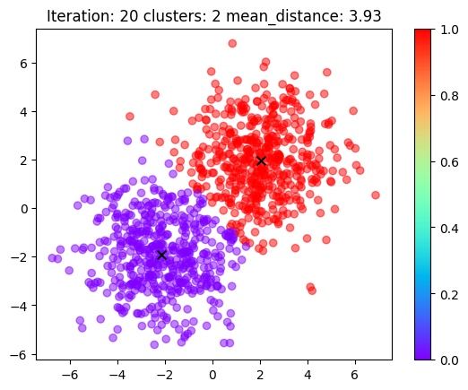
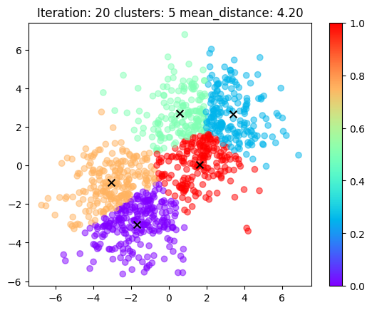

# Kmeans😋

| two gaussians dataset| kmeans with 2 clusters | kmeans with 5 clusters |
|:-----------------------:|:----------------------:|:----------------------:|
|  |  |  |

Minimal, readable, simple code for k-means algorithm in Pytorch.

Just several lines of code to understand the k-means algorithm intuitively.

```python
# assume X is a tensor of shape (n_samples, d_features)
# and we want to cluster these samples into v_clusters clusters
X = torch.rand(n_samples, d_features)

# random select v_clusters rows from X as initial codebooks, (v_clusters, d_features)
codebooks = X[torch.randint(num_samples, (v_clusters,), dtype=torch.long)] 

for i in range(num_iterations):
    # Euclidean distance, (n_samples, v_clusters)
    distance = torch.cdist(X, codebooks, p=2) 

    # assign each sample to the nearest codebook, (n_samples,)
    codes = distance.argmin(dim=-1) 

    # update codebooks with the mean of samples in the same cluster
    for k in range(v_clusters):
        codebooks[k] = X[codes == k].mean(dim=0)

# codes: the cluster index or label of each sample, (n_samples,)
# codebooks: the final codebooks, (v_clusters, d_features)
```

## More

For more details, please refer to the [`kmeans.ipynb`](./kmeans.ipynb), here also contains the animation of processing k-means algorithm.

```bash
pip install numpy torch einops
```

> Note: 
> - `utils.py` contains the code to generate the two gaussians dataset and the animation code.
> - `more.py`  contains some of the product_quantization demo code when I was struggling with fairseq wav2vec2.0😭😭😭.